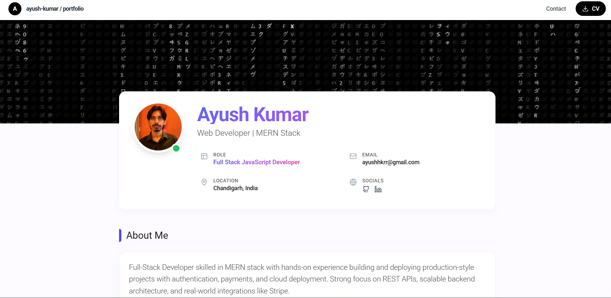

# Portfolio Website

A modern, responsive portfolio website built with React, Vite, and TailwindCSS featuring a sleek Material Design-inspired interface with animated matrix rain effect.



## Features

- **Modern UI/UX**: Clean Material Design-inspired interface with smooth animations
- **Matrix Rain Effect**: Animated background with Japanese characters for a unique visual experience
- **Fully Responsive**: Optimized for desktop, tablet, and mobile devices
- **Interactive Components**: Hover effects, fade-in animations, and smooth transitions
- **Project Showcase**: Gallery-style project cards with live demo and code links
- **Skills Display**: Categorized technical skills with color-coded chips
- **Contact Section**: Easy-to-use contact form with email integration
- **Resume Download**: Direct CV download functionality

## Tech Stack

- **Frontend Framework**: React 19.2.0
- **Build Tool**: Vite 7.2.2
- **Styling**: TailwindCSS 3.4.18
- **Icons**: Lucide React
- **Fonts**: Roboto (Google Fonts)

## Getting Started

### Prerequisites

- Node.js (v16 or higher)
- npm or yarn

### Installation

1. Clone the repository:

```bash
git clone https://github.com/ayushhkrr/portfolio.git
cd portfolio
```

2. Install dependencies:

```bash
npm install
```

3. Start the development server:

```bash
npm run dev
```

4. Open your browser and navigate to `http://localhost:5173`

### Build for Production

```bash
npm run build
```

The optimized production build will be in the `dist` folder.

### Preview Production Build

```bash
npm run preview
```

## Project Structure

```
portfolio/
├── public/
│   ├── portfolio-icon.svg      # Favicon
│   ├── profile.png             # Profile image
│   ├── Resume.pdf              # CV/Resume file
│   ├── promptverse.jpeg        # Project screenshot
│   ├── submanager.jpeg         # Project screenshot
│   └── urlshortner.jpeg        # Project screenshot
├── src/
│   ├── App.jsx                 # Main portfolio component
│   ├── App.css                 # Component styles
│   ├── main.jsx                # App entry point
│   └── index.css               # Global styles
├── index.html                  # HTML template
├── package.json                # Dependencies
├── vite.config.js              # Vite configuration
├── tailwind.config.js          # Tailwind configuration
└── README.md                   # This file
```

## License

This project is open source and available under the [MIT License](LICENSE).

## Contact

**Ayush Kumar**

- Email: [ayushhkrr@gmail.com](mailto:ayushhkrr@gmail.com)
- LinkedIn: [ayush-kumar-a1935b331](https://linkedin.com/in/ayush-kumar-a1935b331)
- GitHub: [@ayushhkrr](https://github.com/ayushhkrr)

## Acknowledgments

- Icons by [Lucide React](https://lucide.dev)
- Fonts by [Google Fonts](https://fonts.google.com)
- Inspired by Material Design principles
